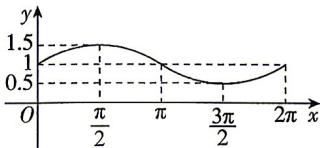

<!-- question-source:start -->
7.[天津南开中学2025高一质量检测]函数 $f(x)=a\sin x+b(x\in[0,2\pi]$ 且 $a,b\in\mathbf{R}$ 的图象如图所示,则函数 $f(x)$ 的解析式为()

A. $f(x) = \frac{1}{2}\sin x + 1,x\in [0,2\pi ]$ B. $f(x) = \sin x + \frac{1}{2},x\in [0,2\pi ]$ C. $f(x) = \frac{3}{2}\sin x + 1,x\in [0,2\pi ]$ D. $f(x) = \frac{3}{2}\sin x + \frac{1}{2},x\in [0,2\pi ]$
<!-- question-source:end -->

![[Q00084430A1]]
