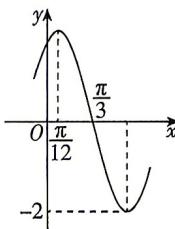

<!-- question-source:start -->
10. [四川绵阳南山中学 2026 高一期中] 已知函数 $f(x) = A \sin (\omega x + \varphi) \left( A > 0, \omega > 0, |\varphi| < \frac{\pi}{2} \right)$ 的部分图象如图所示, 给出下列结论:

① $f(0)=\sqrt{3}$ ;
②当 $x \in \left[-\frac{\pi}{2}, 0\right]$ 时, $f(x) \in [-\sqrt{3}, \sqrt{3}]$ ;

③函数 $f(x)$ 的单调递增区间为 $\left[k\pi-\frac{5\pi}{12},k\pi+\frac{\pi}{12}\right](k\in\mathbf{Z})$ ;
④将 $f(x)$ 的图象向右平移 $\frac{\pi}{3}$ 个单位长度,得到 $y=2\sin2x$ 的图象.
其中正确的结论个数是（）
A. 1 B. 2 C. 3 D. 4
<!-- question-source:end -->

![[Q00084433A1]]
