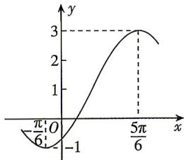

<!-- question-source:start -->
14.[湖北襄阳四中2026高一期末]已知函数 $f(x)=A\sin(\omega x+\varphi)+b$ ，其中 $A<0,\omega>0,0<\varphi<\pi,f(x)$ 的部分图象如图所示.
(1) 求 $f(x)$ 的解析式；
(2) 将曲线 $y = f(x)$ 向右平移 $\frac{\pi}{6}$ 个单位长度后，再将曲线上所有点的横坐标伸长为原来的2倍，纵坐标不变，得到曲线 $y = g(x)$ ，求函数 $g(x)$ 的单调递减区间和图象的对称轴方程.

## 刷易错

## 易错点1 图象平移变换错误
<!-- question-source:end -->

![[Q00084437A1]]
