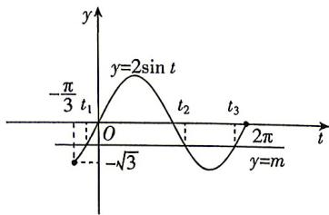

> [!faq]- 答案与解析
>
> > [!success]- **【答案】** B
>
> > [!note]- **【解析】**
> > B 【解析】 $f(x)=\sin\left(4x-\frac{2\pi}{3}\right)+\sqrt{3}$ $\cos\left(4x-\frac{2\pi}{3}\right)-m=2\sin\left(4x-\frac{2\pi}{3}+\frac{\pi}{3}\right)-m=2\sin\left(4x-\frac{\pi}{3}\right)-m,$ 令 $f(x)=0$ ，得 $m=2\sin\left(4x-\frac{\pi}{3}\right)$ ，
> >
> > 令 $t=4x-\frac{\pi}{3}$ ，又 $x\in\left[0,\frac{7\pi}{12}\right]$ ，则 $4x-\frac{\pi}{3}\in\left[-\frac{\pi}{3},2\pi\right]$ ，作出 $y=2\sin t$ 在 $t\in\left[-\frac{\pi}{3},2\pi\right]$ 上的图象，如图所示.
> >
> > 又因为 $f(x)$ 在区间 $\left[0,\frac{7\pi}{12}\right]$ 上恰有 3 个零点，所以直线 y=m 与 $y=2\sin t$ 在 $t\in\left[-\frac{\pi}{3},2\pi\right]$ 上的图象有 3 个交点，对应的横坐标分别为 $t_{1},t_{2},t_{3}(t_{1}<t_{2}<t_{3})$ ，
> >
> > 由图知 $t_{1}+t_{2}=\pi,t_{2}+t_{3}=3\pi$ ，又 $t_{1}=4x_{1}-\frac{\pi}{3},t_{2}=4x_{2}-\frac{\pi}{3},t_{3}=4x_{3}-\frac{\pi}{3}$ ，
> >
> > 则 $2x_{1}+x_{2}-x_{3}=\frac{1}{2}t_{1}+\frac{\pi}{6}+\frac{1}{4}t_{2}+\frac{\pi}{12}-\frac{1}{4}t_{3}-\frac{\pi}{12}=\frac{1}{2}t_{1}+\frac{1}{4}(t_{2}-t_{3})+\frac{\pi}{6}$ ，
> >
> > 又 $t_{1}=\pi-t_{2},t_{3}=3\pi-t_{2}$ ，所以 $2x_{1}+x_{2}-x_{3}=-\frac{\pi}{12}$ . 故选 B.
> >
> > 
