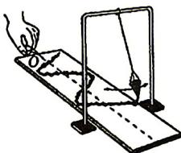
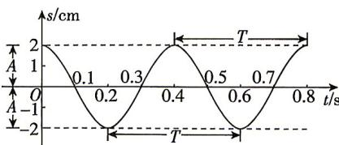

<!-- question-source:start -->
2. 将塑料瓶底部扎一个小孔做成漏斗, 再挂在架子上, 就做成了一个简易单摆. 在漏斗下放纸板, 板的中间画一条直线作为坐标系的横轴, 把漏斗灌上细沙并拉离平衡位置, 放手使它摆动, 同时匀速拉动纸板, 这样就可在纸板上得到一条曲线, 它就是简谐运动的图象. 它表示了漏斗对平衡位置的位移 $s$ (纵坐标) 随时间 $t$ (横坐标) 变化的情况. 如图所示, 已知一根长为 $l \mathrm{~cm}$ 的线一端固定, 另一端悬一个漏斗, 漏斗摆动时离开平衡位置的位移 $s$ (单位: $\mathrm{cm}$ ) 与时间 $t$ (单位: $\mathrm{s}$ ) 的函数关系是 $s = 2 \cos 2 \sqrt{\frac{g}{l}} t$ , 其中 $g \approx 980 \mathrm{~cm} / \mathrm{s}^2$ , $\pi \approx 3$ , 则估计线的长度应当是 (精确到 $0.1 \mathrm{~cm}$ ) ()

<!-- question-source:end -->

![[Q00084464A1]]
