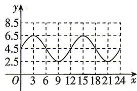

> [!faq]- 答案与解析
>
> > [!success]- **【答案】** 详见解析
>
> > [!note]- **【解析】**
> > 【解】(1)由表中数据可画出函数图象如图所示.
> >
> > 
> >
> > 由图象可知 $A = \frac{6.5 - 2.5}{2} = 2, b = \frac{6.5 + 2.5}{2} = 4.5,$ 函数的最小正周期为 $T = 12 = \frac{2\pi}{\omega}$ ，可得 $\omega = \frac{\pi}{6}$ ，则 $y = 2\cos \left(\frac{\pi x}{6} + \varphi\right) + 4.5$ 又因为当 $x = 3$ 时函数取最大值6.5，即 $2\cos \left(\frac{\pi}{2} + \varphi\right) + 4.5 = 6.5$ ，可得 $-\sin \varphi = 1$ 则 $\sin \varphi = -1.$ 又因为 $-\pi < \varphi < \pi$ ，所以 $\varphi = -\frac{\pi}{2}$ ，故 $y = 2\cos \left(\frac{\pi x}{6} - \frac{\pi}{2}\right) + 4.5.$ (2)货船需要的安全水深为 $4 + 2.2 = 6.2$ 米，所以当 $y \geqslant 6.2$ 时可以进港.
> > 令 $2\cos \left(\frac{\pi x}{6} - \frac{\pi}{2}\right) + 4.5 \geqslant 6.2$ ，可得 $\cos \left(\frac{\pi x}{6} - \frac{\pi}{2}\right) = \sin \frac{\pi x}{6} \geqslant \frac{1.7}{2} \approx \frac{\sqrt{3}}{2},$ 所以 $\frac{\pi}{3} + 2k\pi \leqslant \frac{\pi x}{6} \leqslant \frac{2\pi}{3} + 2k\pi (k \in \mathbf{Z})$ ，解得 $2 + 12k \leqslant x \leqslant 4 + 12k (k \in \mathbf{Z})$ 当 $k = 0$ 时， $x \in [2,4]$ ；当 $k = 1$ 时， $x \in [14,16]$ ，所以该船在2:00或14:00时可以进入港口，每次可以停留2小时.
> >
> > 归纳总结 解三角函数应用问题的一般
> > 步骤
> > 第一步,阅读理解,审清题意.
> > 读题要做到逐字逐句,读懂题中的文字叙述,理解叙述所反映的实际背景,在此基础上,分析出已知什么,求什么,从中提炼出相应的数学问题.
> > 第二步,搜集整理数据,建立数学模型.
> > 根据搜集到的数据,找出变化规律,运用已掌握的三角函数知识、物理知识及其他相关知识建立关系式,在此基础上将实际问题转化为三角函数问题,从而将实际问题数学化,即建立三角函数模型.
> > 第三步,利用所学的三角函数知识对得到的三角函数模型予以解答,求得结果.
> > 第四步,将所得结论转译成实际问题的答案.
