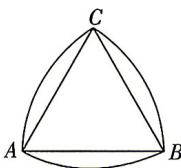

> [!faq]- 答案与解析
>
> > [!success]- **【答案】** $\frac{\pi-\sqrt{3}}{8}$
>
> > [!note]- **【解析】**
> > 莱洛三角形的周长为 $\frac{\pi}{2}$ ,
> > 可得弧长 $\widehat{AB}=\widehat{BC}=\widehat{AC}=\frac{\pi}{6}$ ，则等边三角
> > → 点悟：其对应的圆心角都为 $\frac{\pi}{3}$ 形的边长 AB=BC=AC= $\frac{\frac{\pi}{6}}{\frac{\pi}{3}}=\frac{1}{2}$ .
> >
> > 
> >
> > 故分别以点 A, B, C 为圆心，圆弧 BC, AC, AB 所对的扇形面积均为 $\frac{1}{2} \times \frac{\pi}{6} \times \frac{1}{2} = \frac{\pi}{24}$ ，
> > 等边三角形 ABC 的面积 $S = \frac{1}{2} \times \frac{1}{2} \times \frac{\sqrt{3}}{4} = \frac{\sqrt{3}}{16}$ ,
> > 所以莱洛三角形的面积是 $3 \times \frac{\pi}{24} - 2 \times \frac{\sqrt{3}}{16} = \frac{\pi - \sqrt{3}}{8}$ .
