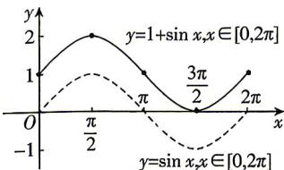
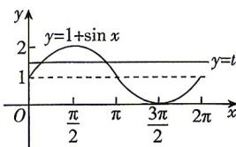

> [!faq]- 答案与解析
>
> > [!success]- **【答案】** D
>
> > [!note]- **【解析】**
> > D 【解析】五个关键点分别为 $(-π,3)$ ， $\left(-\frac{\pi}{2},2\right),(0,1),\left(\frac{\pi}{2},2\right),(\pi,3)$ ，故D选项不在函数 $y=2-\cos x$ 的图象上.故选D.
> > 名师点拨 作正弦曲线、余弦曲线时要掌握“五点法”作图.“五点”即 $y=\sin x$ 或 $y=\cos x$ 的图象在一个周期内的最高点、最低点和与 x 轴的交点.
> >
> > 2【解】(1)由题意,列表:
> >
> > <table><tr><td>x</td><td>0</td><td> $\frac{\pi}{2}$ </td><td>π</td><td> $\frac{3\pi}{2}$ </td><td>2π</td></tr><tr><td>sin x</td><td>0</td><td>1</td><td>0</td><td>-1</td><td>0</td></tr><tr><td>sin x+1</td><td>1</td><td>2</td><td>1</td><td>0</td><td>1</td></tr></table>
> >
> > 描点并将它们用光滑的曲线连接起来,如图所示.
> >
> > 
> >
> > (2) $y=1+\sin x,x\in[0,2\pi]$ 图象如图所示：
> >
> > 
> >
> > 观察图象得: 当 t<0 或 t>2 时, 函数 $y=1+\sin x, x \in [0,2\pi]$ 图象与直线 y=t 有 0 个交点;
> > 当 t=0 或 t=2 时, 函数 $y=1+\sin x, x \in [0,2\pi]$ 图象与直线 y=t 有 1 个交点;
> > 当 0 < t < 1 或 1 < t < 2 时, 函数 $y = 1 + \sin x$ , $x \in [0,2\pi]$ 图象与直线 y=t 有 2 个交点;
> > 当 t=1 时, 函数 $y=1+\sin x, x \in [0,2\pi]$ 图象与直线 y=t 有 3 个交点.
> >
> > 利用诱导公式进行化简是出错的主要原因.
> >
> > ★易错点2 不能确定角之间的特殊关系导致诱导公式应用失误
