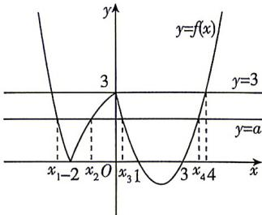

> [!faq]- 答案与解析
>
> > [!success]- **【答案】** ABD
>
> > [!note]- **【解析】**
> > ABD 【解析】作出函数 $f(x)$ 的图象, 如图所示,
> >
> > 
> >
> > 因为 $x_{1}, x_{2}, x_{3}, x_{4}$ 是方程 $f(x) = a$ 的四个互不相等的解，所以结合图象可知 $0 < a < 3, A$ 选项正确；由图可知 $x_{1} < -2 < x_{2} < 0 < x_{3} < 1 < 3 < x_{4} < 4$ ，所点语：由直线 $y = 3$ 与 $y = f(x)$ 图象最右侧交点的横坐标可判断 $x_{4} < 4$ 以 $x_{3}, x_{4}$ 是方程 $x^{2} - 4x + 3 = a, x > 0$ 的两个根，所以 $x_{3} + x_{4} = 4$ ，又 $x_{3} \neq x_{4}$ ，所以 $x_{3} + x_{4} = 4 > 2\sqrt{x_{3}x_{4}}$ ，所以 $x_{3}x_{4} < 4$ ，所以 $\log_2 x_3 + \log_2 x_4 = \log_2 x_3 x_4 < 2, B$ 选项正确； $f(x_2) + x_4 = 4 - \left(\frac{1}{2}\right)^{x_2} + x_4$ ，因为 $-2 < x_2 < 0$ ，所以 $1 < \left(\frac{1}{2}\right)^{x_2} < 4$ ，所以 $0 < 4 - \left(\frac{1}{2}\right)^{x_2} < 3$ ，又 $3 < x_4 < 4$ ，所以 $f(x_2) + x_4 = 4 - \left(\frac{1}{2}\right)^{x_2} + x_4 \in (3,7), C$ 选项错误； $x_{1}, x_{2}$ 是方程 $\left|\left(\frac{1}{2}\right)^{x} - 4\right| = a, x < 0$ 的两个不等实根，则 $\left|\left(\frac{1}{2}\right)^{x_1} - 4\right| = \left|\left(\frac{1}{2}\right)^{x_2} - 4\right|$ ，即 $\left(\frac{1}{2}\right)^{x_1} - 4 + \left(\frac{1}{2}\right)^{x_2} - 4 = 0$ ，所以 $\left(\frac{1}{2}\right)^{x_1} + \left(\frac{1}{2}\right)^{x_2} = 8$ ，整理得 $\left(\frac{1}{2}\right)^{x_1} + \left(\frac{1}{2}\right)^{x_2} = 8 \geqslant 2\sqrt{\left(\frac{1}{2}\right)^{x_1} \times \left(\frac{1}{2}\right)^{x_2}} = 2\sqrt{\left(\frac{1}{2}\right)^{x_1 + x_2}}$ ，当且仅当 $x_{1} = x_{2} = -2$ 时等号成立，又 $x_{1} \neq x_{2}$ ，所以 $x_{1} + x_{2} > -4$ ，因为 $x_{1} < -2, x_{2} < 0$ ，所以 $x_{1} + x_{2} < -2$ ，所以 $-4 < x_{1} + x_{2} < -2$ ，所以 $x_{1} + x_{2} + x_{3} + x_{4} = x_{1} + x_{2} + 4 \in (0,2), D$ 选项正确。
> >
> > 故选 **ABD**.
