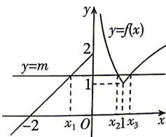

> [!faq]- 答案与解析
>
> > [!success]- **【答案】** C
>
> > [!note]- **【解析】**
> > C 【解析】由 $g(x)=f(x)-m$ 恰有 3 个零点，得方程 $f(x)-m=0$ 有 3 个不同的实根，
> > 即函数 $y=f(x)$ 的图象与直线 y=m 恰有 3 个交点.
> > 画出函数 $f(x)$ 的图象, 如图所示, 由图可知, $1<m\leqslant2$ , 所以 $1<x_{1}+2\leqslant2$ , 所以 $-1<x_{1}\leqslant0$ . 由 $\left|\log_{2}x_{2}\right|+1=\left|\log_{2}x_{3}\right|+1$ , 得 $\left|\log_{2}x_{2}\right|=\left|\log_{2}x_{3}\right|$ , 因为 $x_{2}<x_{3}$ , 所以 $\log_{2}x_{2}<\log_{2}x_{3}$ , 所以 $\log_{2}x_{2}=-\log_{2}x_{3}$ , 即
> > → 点悟：结合函数单调性去绝对值 $\log_{2}x_{2}+\log_{2}x_{3}=0$ , 即 $\log_{2}(x_{2}x_{3})=0$ , 所以 $x_{2}x_{3}=1$ . 因此, $-1+1<x_{1}+x_{2}x_{3}\leqslant0+1$ , 即 $0<x_{1}+x_{2}x_{3}\leqslant1$ . 故选 C.
> >
> > 
> >
> > ## 归纳总结 根据函数有零点求参数取值范围常用的方法
> >
> > (1) 直接法: 直接根据题设条件构建关于参数的不等式, 再通过解不等式确定参数范围;
> > (2) 分离参数法: 将参数分离, 转化成求函数值域问题加以解决;
> > (3) 数形结合法: 先对解析式变形, 在同一平面直角坐标系中, 画出函数的图象, 然后数形结合求解.
