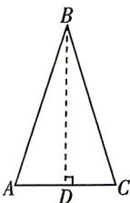

> [!faq]- 答案与解析
>
> > [!success]- **【答案】** A
>
> > [!note]- **【解析】**
> > A 【解析】如图所示, 在等腰三角形 ABC 中, AC 为底边, $\angle ABC = 36^{\circ}$ , $\frac{AC}{AB} = \frac{\sqrt{5} - 1}{2}$ ,
> > 作 BD⊥AC, 垂足为 D, 则 $\angle ABD = 18^{\circ}$ ,
> > 所以 $\sin 18^{\circ}=\frac{AD}{AB}=\frac{\sqrt{5}-1}{4}$
> >
> > 所以 $\sin 126^{\circ} = \cos 36^{\circ} = 1 - 2\sin^{2}18^{\circ} = 1-$ 点悟： $\sin 126^{\circ} = \sin (90^{\circ} + 36^{\circ}) =$ $\cos 36^{\circ}$ $2\times \left(\frac{\sqrt{5} - 1}{4}\right)^{2} = \frac{1 + \sqrt{5}}{4}.$ 故选A.
> >
> > 
