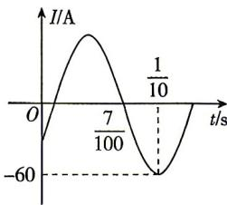

<!-- question-source:start -->
3. (多选) [甘肃白银部分学校 2025 高一期末联考] 已知一正弦电流 $I$ (单位: A) 随时间 $t$ (单位: s) 变化的函数 $I = A \sin (\omega t + \varphi)$ ( $A > 0, \omega > 0$ , 闭上眼睛, 好好回想之前的努力, 自信会喷涌而出。

答案 P261

$|\varphi|<\frac{\pi}{2}$ ）的部分图象如图所示，则（）

$$
A = 6 0
$$

$$
\omega = \frac {5 0 \pi}{3}
$$

$$
\varphi = \frac {\pi}{6}
$$

D. 在一个周期内, 电流不超过 $30 \mathrm{~A}$ 的时长为 $\frac{2}{25} \mathrm{~s}$
<!-- question-source:end -->

![[Q00084465A1]]
