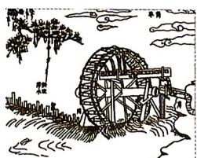
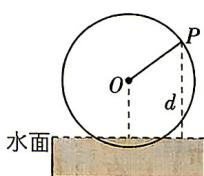

<!-- question-source:start -->
4. [2026T8 联考]图①是古书《天工开物》中记载的筒车图. 筒车是我国古代发明的一种水利灌溉工具, 在农业上得到广泛应用. 在图②中, 一个半径为 $2 \mathrm{~m}$ 的筒车按逆时针方向每分钟转1.5圈, 筒车的轴心 $O$ 距水面的高度为 $\sqrt{3} \mathrm{~m}$ . 设筒车上的某个盛水桶 $P$ (看作点) 到水面的距离为 $d$ (单位: $\mathrm{m}$ ) (若在水面下则 $d$ 为负数), 若以盛水桶 $P$ 刚浮出水面时开始计时, $d$ 与时间 $t$ (单位: $\mathrm{s}$ ) 之间的关系为 $d = A \sin (\omega t + \varphi) + K(A > 0, \omega > 0, -\frac{\pi}{2} < \varphi < \frac{\pi}{2})$ , 则 $\varphi =$ ( )

图①
图②

A. $-\frac{\pi}{3}$ B. $-\frac{\pi}{6}$ C. $\frac{\pi}{6}$ D. $\frac{\pi}{3}$
<!-- question-source:end -->

![[Q00084466A1]]
