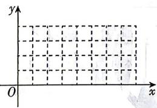

<!-- question-source:start -->
7.[福建莆田2026期中]海水受日月的引力,在一定的时候发生涨落的现象叫潮.一般地,早潮叫潮,晚潮叫汐.在通常情况下,船在涨潮时驶进航道,靠近码头;卸货后,在落潮时返回海洋.下面是某港口在某季节每天的时间与水深关系表:

<table><tr><td>时刻</td><td>0:00</td><td>3:00</td><td>6:00</td><td>9:00</td><td>12:00</td><td>15:00</td><td>18:00</td><td>21:00</td><td>24:00</td></tr><tr><td>水深/米</td><td>4.5</td><td>6.5</td><td>4.5</td><td>2.5</td><td>4.5</td><td>6.5</td><td>4.5</td><td>2.5</td><td>4.5</td></tr></table>

(1) 已知该港口的水深 y 与时刻 x 间的变化满足函数 $y = A \cos(\omega x + \varphi) + b (A > 0, \omega > 0, b > 0, -\pi < \varphi < \pi)$ ,

画出函数图象,并求出函数解析式.

(2)现有一艘货船的吃水深度(船底与水面的距离)为4米,安全条例规定至少要有2.2米的间隙(船底与海底的距离),该船何时能进入港口?在港口能待多久?(忽略进出港所需时间,参考数据: $\sqrt{3}\approx1.7$ )
<!-- question-source:end -->

![[Q00084469A1]]
