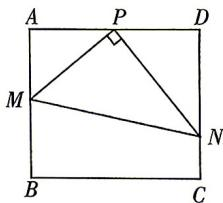

<!-- question-source:start -->
8. 如图, 在矩形 $ABCD$ 中, $AB = 2\sqrt{3}$ , $BC = 4$ , 点 $M$ , $N$ 分别在线段 $AB, CD$ (含端点) 上, $P$ 为 $AD$ 的中点, $PM \perp PN$ , 设 $\angle APM = \alpha$ .

(1)求角 $\alpha$ 的取值范围；

(2) 求出 $\triangle PMN$ 的周长 $l$ 关于角 $\alpha$ 的函数解析式 $f(\alpha)$ , 并求 $\triangle PMN$ 的周长 $l$ 的最小值及此时 $\alpha$ 的值.

## 刷能力
<!-- question-source:end -->

![[Q00084470A1]]
