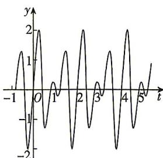

<!-- question-source:start -->
5.[黑龙江大庆实验中学2026高一月考]声音是由物体振动而产生的声波通过介质(空气、固体或液体)传播并能被人或动物的听觉器官所感知的波动现象.在现实生活中经常需要把两个不同的声波进行合成,这种技术被广泛运用在乐器的调音和耳机的主动降噪技术方面.技术人员获取某种声波,其数学模型记为 $H(t)$ ,其部分图象如图所示,对该声波进行逆向分析,发现它是由 $S_{1},S_{2}$ 两种不同的声波合成得到的, $S_{1},S_{2}$ 的数学模型分别记为 $f(t)$ 和 $g(t)$ ,满足 $H(t)=f(t)+g(t)$ .已知 $S_{1},S_{2}$ 两种声波的数学模型源自于下列四个函数中的两个.

① $y=\sin\frac{\pi}{2}t$ ; ② $y=\sin2\pi t$ ; ③ $y=\sin3\pi t$ ;

$$
④ y = 2 \sin 3 \pi t.
$$

则 $S_{1}, S_{2}$ 两种声波的数学模型是 \_\_\_\_.（填写序号）
<!-- question-source:end -->

![[Q00084475A1]]
