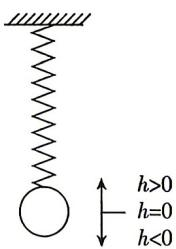

<!-- question-source:start -->
6.[河南漯河高中2025高二月考]如图,弹簧挂着的小球做上下运动,它在t秒时相对于平衡位置的高度h(单位:厘米)由关系式 $h(t)=A\sin(\omega t+\varphi)$ 确定,其中A>0, $\omega>0$ , $|\varphi|<\pi$ .小球从最低点出发,2秒后,第一次回到最低点,则下列说法中正确的有\_\_\_\_.

① $h(t)=A\sin\left(\pi t+\frac{\pi}{2}\right)$ ;

②t=9 与 $t=\frac{5}{3}$ 时小球偏离平衡位置的距离之比为 2:1;

③当 $0 < t < t_0$ 时，若小球有且只有三次到达最高点，则 $t_0 \in (5,7]$ ；

④当 $0 < t_{1} < t_{2} < 2$ 时，若 $t_{1}, t_{2}$ 时刻小球偏离平衡位置的距离相同，则 $\sin \frac{\pi}{t_1 + t_2} = 1$ .
<!-- question-source:end -->

![[Q00084476A1]]
