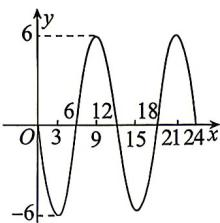

<!-- question-source:start -->
8. 如图所示的图象显示的是相对平均海平面的某海湾的水面高度 $y$ (单位: m) 在某天 24 小时内的变化情况, 则水面高度 $y$ 关于从夜间 0 时开始

的时间 $x$ （单位：时）的函数关系式为 $\_ \_ \_ \_ \_ \_ \_ \_ \_ \_ \_ \_ \_ \_ \_ \_ \_ \_ \_ \_ \_ \_ \_ \_ \_ \_ \_ \_ \_ x\in [0,24].$
<!-- question-source:end -->

![[Q00084478A1]]
