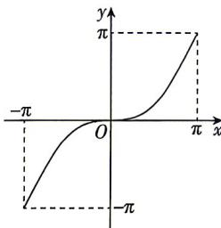

<!-- question-source:start -->
3.[重庆外国语学校2026高一月考]函数 $f(x)$ 的部分图象如图所示,则 $f(x)$ 可能是()

A. $f(x) = x + \tan x$ B. $f(x) = x^{2} + \sin |x|$ C. $f(x) = x - \sin x$ D. $f(x) = x + \sin x$
<!-- question-source:end -->

![[Q00084482A1]]
