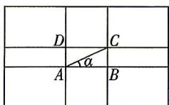

<!-- question-source:start -->
4.[湖南邵阳2026高一期末]“黄金九宫格”是黄金分割构图的一种形式,是指把图片横竖各分三部分,以比例1:0.618:1为分隔,4个交叉点即为黄金分割点.如图,分别用A,B,C,D表示黄金分割点.若图片长、宽比例为8:5,设 $\angle CAB=\alpha$ ,则 $\frac{\cos 2\alpha}{\sin 2\alpha}=$ ( )

A. $-\frac{1}{8}$ B. $\frac{49}{89}$ C. $\frac{5}{8}$ D. $\frac{39}{80}$

你要去看更大的世界，成为你想成为的人。

建议用时:120 分钟 答案 P263
<!-- question-source:end -->

![[Q00084483A1]]
