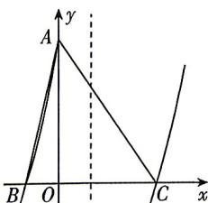

<!-- question-source:start -->
11. $$
f (x) = \sqrt {3} \tan (2 x +
$$

$$
\varphi) \left(| \varphi | <   \frac {\pi}{2}\right)
$$

与坐标轴分别交于点 $A(0, \sqrt{3}), B, C$ ，则以下说法正确的是 （）

A. $\triangle ABC$ 的面积是 $\frac{3\pi}{4}$ B. $f(x)$ 的定义域为 $\left\{x \mid x \neq \frac{k\pi}{2} + \frac{\pi}{8}, k \in \mathbf{Z}\right\}$ C. $f(x)$ 在 $\left(-\frac{3\pi}{8}, \frac{\pi}{12}\right)$ 上单调递增
D. 直线 $x = \frac{3\pi}{8}$ 是 $y = |f(x)|$ 图象的一条对称轴

## 三、填空题: 本大题共 3 小题, 每小题 5 分, 共 15 分.
<!-- question-source:end -->

![[Q00085324A1]]
