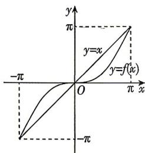

> [!faq]- 答案与解析
>
> > [!success]- **【答案】** $y = 6\sin \left(\frac{\pi}{7} x - \frac{9\pi}{14}\right) + 21$
>
> > [!note]- **【解析】**
> > 若以1月份为最低气温，8月份为最高气温，则可得 $A = \frac{27 - 15}{2} = 6,b = \frac{27 + 15}{2} = 21,T = (8 - 1)\times 2 =$ 14,所以 $\omega = \frac{2\pi}{T} = \frac{\pi}{7}$ 所以 $y = 6\sin \left(\frac{\pi}{7} x + \varphi\right) +$ 21.将点(1,15)，(8,27)的坐标分别代入，
> >
> > ## 第五章素养检测
> >
> > 
