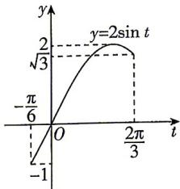

> [!faq]- 答案与解析
>
> > [!success]- **【答案】** D
>
> > [!note]- **【解析】**
> > D 【解析】因为 $\cos\frac{\alpha}{2}=\frac{\sqrt{5}}{5}$ ，所以 $\cos\alpha=2\cos^{2}\frac{\alpha}{2}-1=-\frac{3}{5}$ ，又 $0<\alpha<\pi$ ，所以 $\sin\alpha=\sqrt{1-\cos^{2}\alpha}=\sqrt{1-\frac{9}{25}}=\frac{4}{5}$ ，则 $\sin\left(\alpha-\frac{\pi}{4}\right)=\frac{\sqrt{2}}{2}\left(\sin\alpha-\cos\alpha\right)=\frac{\sqrt{2}}{2}\times$ [266]
> >
> > 所以直线 $y = a$ 与 $y = 2\sin t, t \in \left[-\frac{\pi}{6}, \frac{2\pi}{3}\right]$ 的图象有两个不同的交点，作出 $y = 2\sin t, t \in \left[-\frac{\pi}{6}, \frac{2\pi}{3}\right]$ 的图象如图所示.
> >
> > 
> >
> > 由方程 $f(x) = a$ 在 $\left[-\frac{\pi}{4}, \frac{\pi}{6}\right]$ 上有两个不同的实数解，结合图象可知 $a \in [\sqrt{3}, 2)$ . 所以实数 $a$ 的取值范围为 $[\sqrt{3}, 2)$ . (3) $g(x) = f\left(\frac{3}{2} x - \frac{\pi}{12}\right) = 2\sin \left[2\left(\frac{3}{2} x - \frac{\pi}{12}\right) + \frac{\pi}{3}\right] = 2\sin \left(3x + \frac{\pi}{6}\right)$ , 当 $x_1 \in \left[0, \frac{\pi}{3}\right]$ 时， $3x_1 + \frac{\pi}{6} \in \left[\frac{\pi}{6}, \frac{7\pi}{6}\right]$ ，则 $g(x_1) \in [-1, 2]$ ，当 $x_2 \in \left[\frac{\pi}{6}, \frac{\pi}{3}\right]$ 时， $2x_2 + \frac{\pi}{3} \in \left[\frac{2\pi}{3}, \pi\right]$ ，
