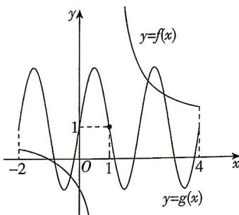

> [!faq]- 答案与解析
>
> > [!success]- **【答案】** B
>
> > [!note]- **【解析】**
> > B 【解析】因为 $f(x) = \frac{x + 1}{x - 1} = \frac{x - 1 + 2}{x - 1} = 1 + \frac{2}{x - 1}$ ，所以 $f(2 - x) = 1 + \frac{2}{2 - x - 1} = 1 - \frac{2}{x - 1}$ ，所以 $f(x) + f(2 - x) = 1 + \frac{2}{x - 1} + 1 - \frac{2}{x - 1} = 2$ ，所以 $f(x)$ 的图象关于点(1,1)中心对称。又因为 $g(x) + g(2 - x) = 1 + 2\sin \pi x + 1 + 2\sin \pi (2 - x) = 1 + 2\sin \pi x + 1 - 2\sin \pi x = 2$ ，所以 $g(x)$ 的图象关于点(1,1)中心对称。→ 点悟： $f(x), g(x)$ 的图象均关于点(1,1)对称，则其交点也关于点(1,1)对称在同一平面直角坐标系中作出 $y = f(x)$ ， $y = g(x) (x \in [-2,4])$ 的图象，如图所示，由图象可知， $f(x),g(x)$ 的图象共有4个交点，不妨设 $x_{1} <   x_{2} <   x_{3} <   x_{4}$ 由图象的对称性可知， $x_{1} + x_{4} = x_{2} + x_{3} = 2,$ $y_{1} + y_{4} = y_{2} + y_{3} = 2,$ 所以 $\sum_{i = 1}^{n}x_{i} + \sum_{i = 1}^{n}y_{i} = 2\times 2 + 2\times 2 = 8,$ 故选B.
> >
> > 
