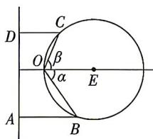

<!-- question-source:start -->
3. 已知点 $O$ 在半径为 $r$ 的圆 $E$ 上, 直线 $AD \perp OE$ , 且圆心 $E$ 到 $AD$ 的距离为 $m\left(1 < \frac{m}{r} < \frac{3}{2}\right)$ , 如图. 以 $O$ 为顶点, 射线 $OE$ 为始边, 角 $\alpha$ , $\beta\left(-\frac{\pi}{2} < \alpha \leqslant 0, 0 \leqslant \beta < \frac{\pi}{2}\right)$ 的终边与圆 $E$ 分别交于点 $B, C$ , 点 $B, C$ 到直线 $AD$ 的距离与到点 $O$ 的距离相等.

(1) 求 $\cos \alpha + \cos \beta$ 的值;

(2) 求 $\sin \alpha - \sin \beta$ 的取值范围.

<!-- question-source:end -->

![[Q00084519A1]]
