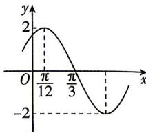

<!-- question-source:start -->
18.（本小题满分17分）[四川绵阳2026高一月考]已知函数 $f(x) = A \sin (\omega x + \varphi)$ （ $A > 0, \omega > 0, 0 < |\varphi| < \frac{\pi}{2}$ ）的部分图象如图所示.
(1) 求函数 $f(x)$ 的解析式；
(2) 函数 $g(x)=f(x)-1$ 在 $\left[-\frac{\pi}{6},m\right]$ 上有且仅我们风雨兼程，绝不空手而归。

有两个零点,求实数 m 的取值范围;
(3) 若关于 x 的方程 $\frac{f^{2}(x)}{4} + 2a\sin\left(2x - \frac{\pi}{6}\right) - 2a + 2 = 0$ 在 $\left(0, \frac{\pi}{3}\right)$ 上有解, 求实数 a 的取值范围.

<!-- question-source:end -->

![[Q00084550A1]]
