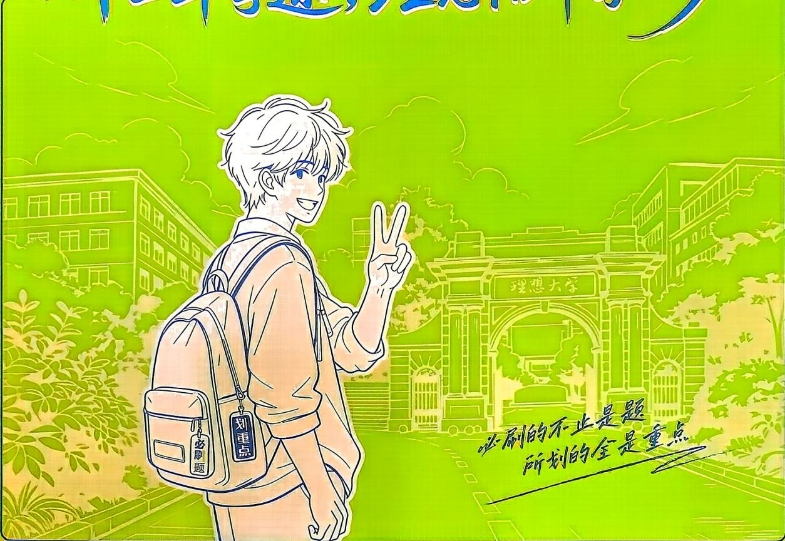
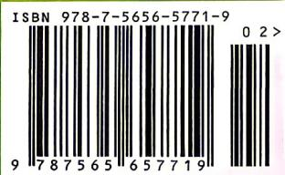

<!-- question-source:start -->
19. (本小题满分 17 分) [河南信阳 2025 高一月考] 已知函数 $f(x) = \log_2(4^x + 1) - kx (k \in \mathbb{R})$ 是偶函数, $g(x) = \log_2\left(a \cdot 2^x - \frac{4}{3} a\right)$ (其中 $a > 0$ ).

(1) 求 $g(x)$ 的定义域;

(2) 求 $k$ 的值;

(3) 若函数 $f(x)$ 与 $g(x)$ 的图象有且只有一个交点, 求实数 $a$ 的取值范围.

图书在版编目（CIP）数据

高中必刷题. 数学：必修. 第一册：RJ / 赵成海等主编. -- 北京：首都师范大学出版社, 2020.6（2026.4 重印）

ISBN 978-7-5656-5771-9

I. ①高… II. ①赵… III. ①中学数学课—高中—习题集 IV. ①G634

中国版本图书馆 CIP 数据核字 (2020) 第 052604 号

高中必刷题 数学 必修 第一册 RJ

赵成海 等主编

责任编辑 王晶

首都师范大学出版社出版发行

地址 北京市西三环北路105号

邮编 100048

电话 010-68418523（总编室） 010-68982468（发行部）

网址 http://cnupn.cnu.edu.cn

印刷 河北新诚印刷有限公司

经销 全国新华书店

版 次 2020年6月第1版

印 次 2026年4月第7次印刷

开 本 $880\mathrm{mm}\times 1230\mathrm{mm}$ 1/16

印 张 25.5

字 数 587千

定价 69.80 元

版权所有 违者必究

如有质量问题 请与出版社联系退换

更多资料关注公众号：瀚升学堂

十二年学途，理想陪伴每一步

新高一课程表（仅供参考）

<table><tr><td>科目</td><td>语文</td><td>数学</td><td>英语</td><td>物理</td><td>化学</td><td>生物学</td><td>历史</td><td>地理</td><td>政治</td></tr><tr><td rowspan="2">高一上</td><td rowspan="2">必修上册</td><td rowspan="2">必修第一册</td><td rowspan="2">必修第一册必修第二册</td><td rowspan="2">必修第一册必修第二册</td><td rowspan="2">必修第一册</td><td rowspan="2">必修1分子与细胞</td><td rowspan="2">必修中外历史纲要上</td><td rowspan="2">必修第一册</td><td>必修1中国特色社会主义</td></tr><tr><td>必修2经济与社会</td></tr><tr><td>高一下</td><td>必修下册</td><td>必修第二册</td><td>必修第三册</td><td>必修第三册</td><td>必修第二册</td><td>必修2遗传与进化</td><td>必修中外历史纲要下</td><td>必修第二册</td><td>必修3政治与法治</td></tr></table>

策划：盛晓萌 郑玲

责任编辑：王晶

执行编辑：宋文姣

封面设计：smart 巩欣晔

定价：69.80元

(共三册，本册不单独销售)

【温馨提示】本页为广告页，打印前可以把这页删掉

<!-- question-source:end -->

![[Q00084551A1]]
