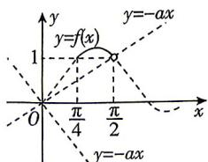

> [!faq]- 答案与解析
>
> > [!success]- **【答案】** $\left\{a \mid a \geqslant -\frac{2}{\pi}\right\}$
>
> > [!note]- **【解析】**
> > 记函数 $f(x) = \sin x (\sin x + \cos x) = \frac{1 - \cos 2x}{2} + \frac{\sin 2x}{2} = \frac{1}{2} \left[ 1 + \sqrt{2} \sin \left( 2x - \frac{\pi}{4} \right) \right]$ ,
> > 由 $x \in \left[\frac{\pi}{4}, \frac{\pi}{2}\right)$ ，得 $2x - \frac{\pi}{4} \in \left[\frac{\pi}{4}, \frac{3\pi}{4}\right)$ ，故函数 $f(x)$ 在区间 $\left[\frac{\pi}{4}, \frac{3\pi}{8}\right)$ 上单调递增，在区间 $\left(\frac{3\pi}{8}, \frac{\pi}{2}\right)$ 上单调递减。又 $ax + \sin x (\sin x + \cos x) \geqslant 0$ 等价于 $-ax \leqslant f(x)$ ，如图，作出函数 y = -ax 与函数 $y = f(x)$ 在区间 $\left[\frac{\pi}{4}, \frac{\pi}{2}\right)$ 上的图象，由图可知，函数
> >
> > → 故黑板：将不等式进行转化，把所求的问题转化为函数图象的问题 $y = -ax$ 在 $\left[\frac{\pi}{4}, \frac{\pi}{2}\right)$ 上的图象不在过点 (0,0)， $\left(\frac{\pi}{2}, 1\right)$ 的直线 $y = \frac{2}{\pi}x$ 的上方时，满足题意，故 $-a \leqslant \frac{2}{\pi}$ ，即实数 a 的取值范围为 $\left\{a \mid a \geqslant -\frac{2}{\pi}\right\}$ .
> >
> > 
> >
> > 刷素养…
