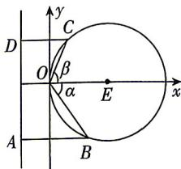

> [!faq]- 答案与解析
>
> > [!success]- **【答案】** 详见解析
>
> > [!note]- **【解析】**
> > 【解】(1)以点 O 为坐标原点, 以 OE 所在直线为 x 轴建立平面直角坐标系, 如图所示, 则 $B(2r\cos^{2}\alpha, 2r\cos\alpha\sin\alpha)$ , $C(2r\cos^{2}\beta, 2r\cos\beta\sin\beta)$ .
> > 又 $\left|OB\right| = \left|AB\right|$ , $\left|OC\right| = \left|CD\right|$ ,
> > 则 $\left\{\begin{aligned}&2r\cos\alpha=2r\cos^{2}\alpha+m-r,\\ &2r\cos\beta=2r\cos^{2}\beta+m-r,\end{aligned}\right.$ 两式相减, 得 $\cos \alpha + \cos \beta = 1$ .
> >
> > 
> >
> > (2) 因为 $(\cos \alpha + \cos \beta)^{2} + (\sin \alpha - \sin \beta)^{2} = 2 + 2(\cos \alpha \cos \beta - \sin \alpha \sin \beta) = 2 + 2\cos (\alpha + \beta)$ ，又 $-\frac{\pi}{2} < \alpha \leqslant 0, 0 \leqslant \beta < \frac{\pi}{2}$ ，所以 $0 < \cos (\alpha + \beta) \leqslant 1$ ，
> > 故 $2<(\cos\alpha+\cos\beta)^{2}+(\sin\alpha-\sin\beta)^{2}\leqslant4,$ 所以 $1<(\sin\alpha-\sin\beta)^{2}\leqslant3,$ 所以 $\sin\alpha-\sin\beta\in[-\sqrt{3},-1)\cup(1,\sqrt{3}]$ .
> > 又由 $-\frac{\pi}{2}<\alpha\leqslant0,0\leqslant\beta<\frac{\pi}{2}$ ，可知 $-1<\sin\alpha\leqslant0,0\leqslant\sin\beta<1,$ 故 $-2<\sin\alpha-\sin\beta\leqslant0,$ 故 $\sin\alpha-\sin\beta$ 的取值范围为 $[- \sqrt{3}, -1)$ .
