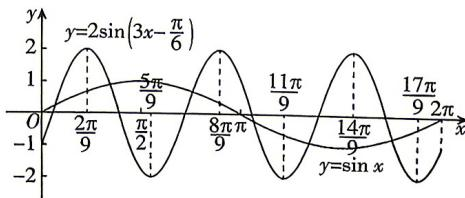

> [!faq]- 答案与解析
>
> > [!success]- **【答案】** C
>
> > [!note]- **【解析】**
> > C 【解析】令 $3x - \frac{\pi}{6} = \frac{\pi}{2} + k_{1}\pi, k_{1} \in Z$ ,
> > 则 $x=\frac{2\pi}{9}+\frac{k_{1}\pi}{3},k_{1}\in Z,$ 又 $x \in [0, 2\pi]$ ，所以 $x = \frac{2\pi}{9}, \frac{5\pi}{9}, \frac{8\pi}{9}, \frac{11\pi}{9},$ $\frac{14\pi}{9}, \frac{17\pi}{9}.$ 令 $3x - \frac{\pi}{6} = k_{2}\pi, k_{2} \in Z$ ，则 $x = \frac{\pi}{18} + \frac{k_{2}\pi}{3}$ ， $k_{2} \in Z,$ 又 $x \in [0, 2\pi]$ ，所以 $x = \frac{\pi}{18}, \frac{7\pi}{18}, \frac{13\pi}{18},$ $\frac{19\pi}{18}, \frac{25\pi}{18}, \frac{31\pi}{18},$ 如图，作出函数 $y = \sin x$ 与 $y = 2\sin\left(3x - \frac{\pi}{6}\right)$ 在 $[0, 2\pi]$ 上的大致图象，由图可知，两函数图象共有6个交点。故选C.
> >
> > 
