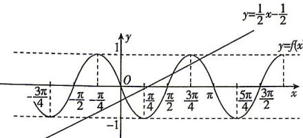

> [!faq]- 答案与解析
>
> > [!success]- **【答案】** C
>
> > [!note]- **【解析】**
> > C 【解析】由题意知 $f(x) = \cos \left[2\left(x + \frac{\pi}{6}\right) + \frac{\pi}{6}\right] = \cos \left(2x + \frac{\pi}{2}\right) = -\sin 2x$ ，画出函数 $f(x)$ 的图象和直线 $y = \frac{1}{2} x - \frac{1}{2}$ , 如图.
> >
> > 
> >
> > 由图象可知,函数 $y=f(x)$ 的图象与直线 $y=\frac{1}{2}x-\frac{1}{2}$ 有 3 个交点,
> >
> > 故选 **C**.
