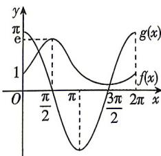

> [!faq]- 答案与解析
>
> > [!success]- **【答案】** 4
>
> > [!note]- **【解析】**
> > 设 $f(x) = \mathrm{e}^{\sin x}, g(x) = \pi \cos x$ ，由正弦函数、余弦函数的周期性可知 $f(x), g(x)$ 是周期为 $2\pi$ 的周期函数。方程 $\mathrm{e}^{\sin x} = \pi \cos x$ 在 $[0, 4\pi]$ 上的解的个数即为函数 $f(x), g(x)$ 的图象在 $[0, 4\pi]$ 上的交点的个数。当 $x \in [0, 2\pi]$ 时，由正、余弦函数的单调性和复合函数的单调性可知， $f(x) = \mathrm{e}^{\sin x}$ 在 $\left[0, \frac{\pi}{2}\right)$ 单调递增，在 $\left[\frac{\pi}{2}, \frac{3\pi}{2}\right)$ 单调递减，在 $\left[\frac{3\pi}{2}, 2\pi\right]$ 单调递增, $g(x)=\pi\cos x$ 在 $[0,\pi)$ 单调递减,在 $[\pi,2\pi]$ 单调递增, $f(0)=f(\pi)=f(2\pi)=1,f\left(\frac{\pi}{2}\right)=e,f\left(\frac{3\pi}{2}\right)=\frac{1}{e},g(0)=g(2\pi)=\pi,g\left(\frac{\pi}{2}\right)=g\left(\frac{3\pi}{2}\right)=0,g(\pi)=-\pi$ ,作出 $f(x),g(x)$ 在 $[0,2\pi]$ 上的大致图象,如图所示,由图可知 $f(x),g(x)$ 的图象在 $[0,2\pi]$ 上有2个交点,故在 $[0,4\pi]$ 上有4个交点,即方程 $e^{\sin x}=\pi\cos x$ 在 $[0,4\pi]$ 上有4个解.
> >
> > 
