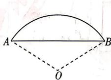

<!-- question-source:start -->

## 8.[山东济南山东师范大学附属中学2026高一月考]《九章算术》是我国古代的数学

名著,其中《方田》一章记录了弧田面积的计算问题.如图,某弧田由弧AB和其所对的弦AB围成,若弦AB长度为2,弧AB所对的圆心角的弧度数为2,则该弧田的面积为( )
A. $\frac{1}{\tan1}$ B. $\frac{1}{\sin^{2}1}$ C. $\frac{1}{\cos^{2}1}-\frac{1}{\tan1}$ D. $\frac{1}{\sin^{2}1}-\frac{1}{\tan1}$
<!-- question-source:end -->

![[Q00085330A1]]
