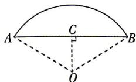

> [!faq]- 答案与解析
>
> > [!success]- **【答案】** D
>
> > [!note]- **【解析】**
> > D【解析】如图，过点 $O$ 作 $OC \perp AB$ ，垂足为 $C$ .
> > 由题意可知， $\angle AOB = 2, AB = 2$ ，则 $\angle AOC = 1, AC = 1$ ，
> > 则 $AO = \frac{AC}{\sin \angle AOC} = \frac{1}{\sin 1}, OC$ $\frac{AC}{\tan \angle AOC} = \frac{1}{\tan 1}$ ，
> > 则该弧田的面积为 $\frac{1}{2} \times 2 \times \left(\frac{1}{\sin 1}\right)^2 - \frac{1}{2} x$ $2 \times \frac{1}{\tan 1} = \frac{1}{\sin^2 1} - \frac{1}{\tan 1}$ . 故选D.
> >
> > 
