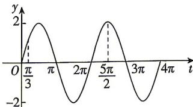

> [!faq]- 答案与解析
>
> > [!success]- **【答案】** AC
>
> > [!note]- **【解析】**
> > AC 【解析】 $f(x)=\sin\omega x+\sqrt{3}\cos\omega x=2\left(\frac{1}{2}\sin\omega x+\frac{\sqrt{3}}{2}\cos\omega x\right)=2\sin\left(\omega x+\frac{\pi}{3}\right)$ .
> > 对于 A, 当 $0 \leqslant x \leqslant \pi$ 时， $\omega x + \frac{\pi}{3} \in \left[\frac{\pi}{3}, \omega \pi + \frac{\pi}{3}\right]$ ,
> > 令 $t=\omega x+\frac{\pi}{3}$ ，作出 $y=2\sin t$ 的图象如图所示， $f(x)$ 在区间 $[0,\pi]$ 上恰有三个零点，由图可得 $\omega\pi+\frac{\pi}{3}\in[3\pi,4\pi)$ ，解得 $\omega\in\left[\frac{8}{3},\frac{11}{3}\right)$ ，故 A 正确；
> >
> > 
> >
> > 对于 BC, 由图可知 $f(x)$ 的图象在 $(0, \pi)$ 上恰有两个最高点, 则 $f(x)$ 的图象在 $(0, \pi)$ 上有三条或四条对称轴, 故 B 错误, C 正确; 对于 D, 令 $-\frac{\pi}{2} + 2k\pi \leqslant \omega x + \frac{\pi}{3} \leqslant \frac{\pi}{2} + 2k\pi, k \in Z$ , 得 $f(x)$ 的单调递增区间为 $\left[\frac{-\frac{5\pi}{6}+2k\pi}{\omega},\frac{\frac{\pi}{6}+2k\pi}{\omega}\right],k\in\mathbf{Z},$ 当 k=0 时， $f(x)$ 在 $\left[\frac{-5\pi}{6\omega},\frac{\pi}{6\omega}\right]$ 上单调递增，由 A 知 $\omega\in\left[\frac{8}{3},\frac{11}{3}\right)$ ，则 $\frac{\pi}{6\omega}\in\left(\frac{\pi}{22},\frac{\pi}{16}\right]$ ，则 $f(x)$ 在 $\left(0,\frac{\pi}{20}\right)$ 上不一定单调递增，故 D 错误.
> >
> > 故选 **AC**.
