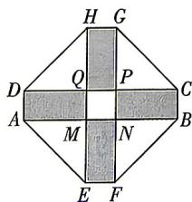

<!-- question-source:start -->
8.[山东部分学校2025高一期中联考]如图,某小区要建一个八边形的休闲场所,它的主体造型平面图是由两个周长均为24 m的相同的矩形

ABCD 和 EFGH 构成的十字形地域. 计划在正方形 MNPQ 上建一座花坛, 造价为 2000 元/ $m^{2}$ ; 在四个相同的矩形 (图中阴影部分) 内铺上塑胶, 造价为 100 元/ $m^{2}$ ; 在四个空角 (图中四个三角形) 内铺上草坪, 造价为 400 元/ $m^{2}$ . 若要使总造价不高于 24000 元, 则正方形 MNPQ 周长的最小值为 \_\_\_\_ m.
<!-- question-source:end -->

![[Q00070906A1]]
