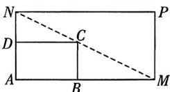

<!-- question-source:start -->
17. (本小题满分 15 分) [四川绵阳中学 2025 高一期末] 如图所示, 将一矩形花坛 ABCD 扩建成一个更大的矩形花坛 AMPN, 要求 B 在 AM 上, D 在 AN 上, 且对角线 MN 过点 C, 已知 AB = 3 米, AD = 2 米.
(1)要使矩形 AMPN 的面积大于 32 平方米, 则 DN 的长应在什么范围?
(2) 当 DN 的长为多少时, 矩形花坛 AMPN 的面积最小? 并求出最小值.

<!-- question-source:end -->

![[Q00070926A1]]
