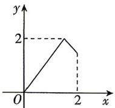
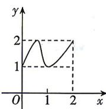
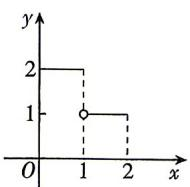
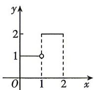

<!-- question-source:start -->
3.[河南省实验中学2026高一月考]已知 $A = \{x\mid 0\leqslant x\leqslant 2\} ,B = \{y\mid 1\leqslant y\leqslant 2\}$ ，下列图象能表示以 $A$ 为定义域， $B$ 为值域的函数的是（）

A

B

C

D

## 题型2 函数对应关系的表示
<!-- question-source:end -->

![[Q00070940A1]]
