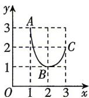

<!-- question-source:start -->
2.[福建福州2026高一期中]已知函数 $f(x)$ 的对应关系如表,函数 $g(x)$ 的图象为如图所示的曲线ABC,其中 $A(1,3)$ , $B(2,1)$ , $C(3,2)$ ,则 $f(g(2))=$

<table><tr><td>x</td><td>1</td><td>2</td><td>3</td></tr><tr><td>f(x)</td><td>2</td><td>3</td><td>0</td></tr></table>

<!-- question-source:end -->

![[Q00070970A1]]
