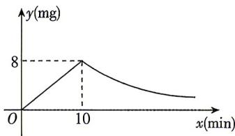

<!-- question-source:start -->
12. 某学校对教室采用药熏消毒, 已知药物燃烧时, 室内每立方米空气中的含药量 $y(\mathrm{mg})$ 与时间 $x(\min)$ 成正比, 药物燃烧完后, $y$ 与 $x$ 成反比 (如图), 现测得药物 $10 \mathrm{~min}$ 燃毕, 此时室内空气中每立方米含药量为 $8 \mathrm{mg}$ . 研究表明, 当空气中每立方米的含药量不低于 $4 \mathrm{mg}$ 才有效,那么此次消毒的有效时间是（）

A. $11 \mathrm{~min}$ B. $12 \mathrm{~min}$ C. $15 \mathrm{~min}$ D. $20 \mathrm{~min}$
<!-- question-source:end -->

![[Q00070980A1]]
