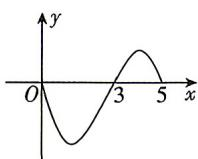

<!-- question-source:start -->
9. 设奇函数 $f(x)$ 的定义域为 $[-5, 5]$ , 当 $x \in [0, 5]$ 时, 函数 $y = f(x)$ 的图象如图所示, 则使 $f(x) < 0$ 的 $x$ 的取值范围为 ( )

A. $(3,5)$ B. $(-5, - 3)\cup (0,3)$ C. $(-5, - 3)$ D. $(-3,0)\cup (0,3)$
<!-- question-source:end -->

![[Q00071049A1]]
