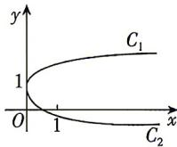

<!-- question-source:start -->
2. 如图, 函数 $f(x)=\frac{m_{1}x+1}{x+1}(x \geqslant 0)$ 与 $g(x)=\frac{m_{2}x+1}{x+1}$ $(x \geqslant 0)$ 的部分图象分别为 $C_{1}, C_{2}$ , 则 ( )

A. $0 < m_{2} < m_{1} < 1$ B. $m_{1} > 1 > m_{2} > 0$ C. $0 < m_{1} < 1, m_{2} < -1$ D. $m_{1} > 1, m_{2} < -1$

<!-- question-source:end -->

![[Q00071067A1]]
