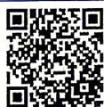
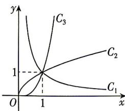

<!-- question-source:start -->
5. 教材 变式 [四川成都七中 2026 高一月考] 图中 $C_{1}, C_{2}, C_{3}$ 为三个幂函数 $(y = x^{\alpha})$ 在第一象限内的图象, 则解析式中指数 $\alpha$ 的值依次可以是 ( )

A.0.5,3,-1 B.-1,3,0.5 C.0.5,-1,3 D.-1,0.5,3
<!-- question-source:end -->

![[Q00071090A1]]
