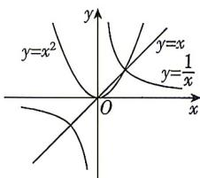

<!-- question-source:start -->
3. 函数 $y = x, y = x^2$ 和 $y = \frac{1}{x}$ 的图象如图所示, 则下列四个说法错误的是 ( )

A.如果 $\frac{1}{a} >a > a^2$ ，那么 $0 <   a <   1$ B.如果 $a^2 >a > \frac{1}{a}$ 那么 $a > 1$ C.如果-1<a<0，那么 $a^2>$ $a > \frac{1}{a}$ D.如果 $a^2 >\frac{1}{a} >a$ ，那么 $a <   - 1$

<!-- question-source:end -->

![[Q00071105A1]]
