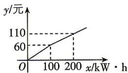

<!-- question-source:start -->
1. 某地供电公司为鼓励小微企业增加夜间时段用电，规定在月度所属夜间计费
y/元
110
60
O 100 200 x/kW·h
时段内采用按用电量分段计费的方法来计算电费,夜间月用电量x(kW·h)与相应电费y(元)之间的函数关系如图所示,当夜间月用电量为300 kW·h时,应交电费为 ( )
A. 130元
B. 140元
C. 150元
D. 160元

<!-- question-source:end -->

![[Q00071111A1]]
