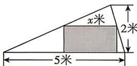

<!-- question-source:start -->
4.[山东枣庄2026高一月考]某民居有一阁楼,现要在阁楼(可视作如图所示的锐角三角形)上开一内接矩形窗户(阴影部分),设其水平的一边长为x米.

(1) 求窗户的面积 $S(x)$ (单位: 平方米), 并求 $S(x)$ 的最大值.

(2)一般认为,民用住宅的窗户面积必须小于地板面积,但窗户面积与地板面积的比应不小知识的掌握,生活的积累,都是沿着螺旋线上升的。

答案 P191

于 $10\%$ . 若阁楼的窗户面积与地板面积的总和为 16.5 平方米, 则当 $x$ 为多少米时窗户面积最小? 最小是多少平方米?

## 题型2 分段函数的应用
<!-- question-source:end -->

![[Q00071114A1]]
