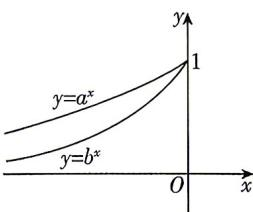

<!-- question-source:start -->
1.[黑龙江绥化2025高一月考]已知两个指数函数 $y=a^{x},y=b^{x}$ 的部分图象如图所示,则()

A. $0 < b < a < 1$ B. $0 < a < b < 1$ C. $a > b > 1$ D. $b > a > 1$
<!-- question-source:end -->

![[Q00071190A1]]
