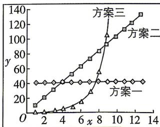

<!-- question-source:start -->
5.[江苏南京六校2025高一期中联考]某工程需要向一个容器内源源不断地注入某种液体,有三种方案可以选择,这三种方案的注入量随时间变化如图所示:

横轴为时间(单位:时),纵轴为注入量,根据以上信息,若使注入量最多,下列说法中错误的是
( )
A. 注入时间在3小时以内(含3小时),采用方案一
B. 注入时间恰为4小时,不采用方案三
C. 注入时间恰为6小时,采用方案二
D. 注入时间恰为10小时,采用方案二
<!-- question-source:end -->

![[Q00071294A1]]
