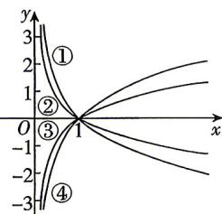

<!-- question-source:start -->
5.[广东茂名2025高一期末]如图,①②③④中不属于函数 $y=\log_{\frac{1}{2}}x,y=\log_{2}x,y=\log_{3}x$ 对应图象的一个是()

A. $①$ B. $②$ C. $③$ D. $④$

答案 P203
<!-- question-source:end -->

![[Q00071255A1]]
