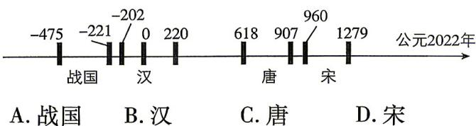

<!-- question-source:start -->
3.[湖北恩施部分学校2025高一期末联考]生物体死亡后,它的机体内原有的碳14含量C会按确定的比率衰减(称为衰减率),C与死亡年数t之间的函数关系式为 $C=0.5^{\frac{t}{k}}$ (k为常数),大约每经过5730年衰减为原来的一半,这个时间称为“半衰期”.若2022年某遗址文物出土时碳14的残余量约为原始量的85%,则可推断该文物属于()参考数据: $\log_{2}0.85\approx-0.23$ ;参考时间轴:

<!-- question-source:end -->

![[Q00071367A1]]
